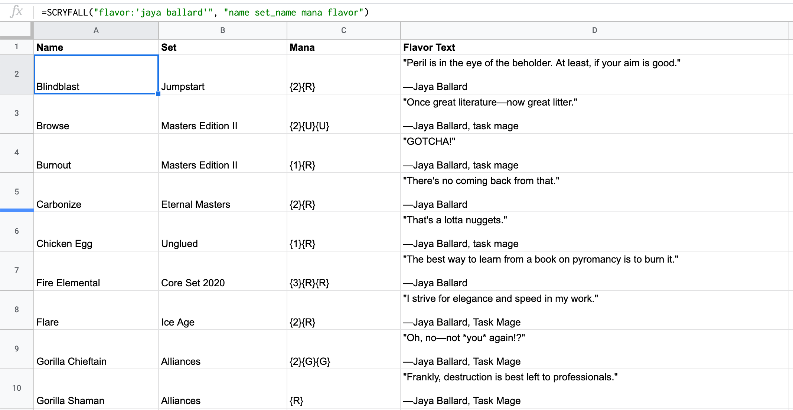

Retrieve Scryfall results from inside Google Sheets



# Installation

1. Copy the contents of [scryfall-google-sheets.js](https://raw.githubusercontent.com/scryfall/google-sheets/main/scryfall-google-sheets.js).
1. Open your sheet and go to **Extensions &rarr; Apps Scripts**
1. Paste the contents of your clipboard into the script editor, then hit Save. (Nothing special will happen. You do not need to hit Deploy.)
1. You're done! The `=SCRYFALL()` function should now be available on your spreadsheet.
1. Return to your spreadsheet. Pick any cell, focus the formula bar up to, and start typing `=SCRYFALL`. Its autocomplete should begin showing up.

# Usage

```
=SCRYFALL(query, fields, num_results, order, dir, unique)
```

* `query`: Scryfall search query.
* `fields`: A single string containing a space-separated list of fields from a card object to return, using `.` for nested items (e.g. prices.eur).
    *For example: `"name type oracle_text power toughness"`*
* `num_results`: Number of results to return (maximum 700)
* `order`: The order to sort cards by, `"name"` is the default. You can find other sort orders [in the API help for sorting cards](https://scryfall.com/docs/api/cards/search#sorting-cards).
* `dir`: Direction to return the sorted cards: `"auto"`, `"asc"`, or `"desc"`
* `unique`: Find unique `"cards"` (default), `"art"`, or `"prints"`.

If you are unsure what fields can be in a [card object](https://scryfall.com/docs/api/cards), here is [an example](https://api.scryfall.com/cards/4dcdcad5-e4fb-480e-984f-1ac5cdc986b9?format=json&pretty=true).

# Examples

As it can be difficult to describe how to use a function, here are some examples:

### List of creatures with 10 or more power
`=SCRYFALL("type:creature pow>=10")`

### The price of every card in Dominaria, sorted by price (USD)
`=SCRYFALL("set:dom", "name prices.usd prices.eur", 750, "price")`

### Legacy legal cards in paper but not available on Magic Online, returning 700 results
`=SCRYFALL("in:paper -in:mtgo legal:legacy", "name", 700)`

### List of cards with Jaya Ballard flavor text, returning card name, set name, mana cost, and flavor text
`=SCRYFALL("flavor:'jaya ballard'", "name set_name mana flavor")`

### Commander cards not available in foil, with name, set name, release date, color identity, URL, and oracle text, sorted by EDHREC popularity
`=SCRYFALL("-in:foil game:paper legal:commander -is:reprint -is:reserved", "name set_name released_at color url oracle", 150, "edhrec")`

# Handling large searches

Note that your search *must* return a result in 30 seconds or less. Asking for too many results can result in 
your spreadsheet showing an ERROR. Repeating a `=SCRYFALL()` function with the same query may work on a second
attempt, as Scryfall caches results.

If you want to have a spreadsheet with more than 700 results, your best bet is to shard your results. For example,
if you wanted a list of all legal Commanders (which has over 1000 results), you can do:

`=SCRYFALL("is:commander legal:commander name:/^[abcdefghijklm]/", "name", 700)`
`=SCRYFALL("is:commander legal:commander name:/^[nopqrstuvwxyz]/", "name", 700)`
